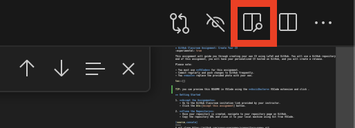

= M1 CSMI Git and GitHub project: Create your CV
:experimental: true
:icons: font

This assignment guides you to create a professional CV in **LaTeX** using **Git** and **GitHub** from **VS Code** (locally or in **GitHub Codespaces**). You will personalize a provided template and publish your final PDF via a **GitHub Release**.

toc::[]

[NOTE]
====
You may work **locally in VS Code** or **entirely in the browser** using https://code.visualstudio.com/docs/remote/codespaces[GitHub Codespaces]. Codespaces gives you a ready-to-use dev environment without installing LaTeX locally.
====

TIP: You can preview this README in VS Code using the *AsciiDoctor* extension (auto-recommended). After installing, click the preview button (top-right). 

== What you will learn
* Core Git workflow: clone, branch, commit, push, pull request, merge.
* Working with a GitHub repository created from a template.
* Editing and compiling LaTeX in **VS Code** (via *LaTeX Workshop*).
* Packaging deliverables using **GitHub Releases**.

== Requirements
* GitHub account and write access to your assignment repository in `master-csmi`.
* **VS Code** locally _or_ **GitHub Codespaces**.
* Replace the sample content and image. A personal photo is optional.
* Commit frequently with **meaningful messages** on a feature branch.

== Getting Started

1. **Open your assignment repository**
   * Your instructor creates a private repository named `m1-2026-cv-<your-github-username>` under `master-csmi` and grants you write access.
   * Open the repository at `https://github.com/master-csmi/m1-2026-cv-<your-github-username>`. If GitHub asks you to accept a repository invitation, accept it first.
   * Keep the repository private while it contains personal information.

2. **Open your repository**
   * **Option A — Codespaces (recommended):**
     * On your repo page → btn:[Code] → tab:[Codespaces] → btn:[Create codespace on main].
   * **Option B — Local VS Code:**
     * Clone the repository and open the folder in VS Code:
+
[source,console]
----
git clone https://github.com/master-csmi/m1-2026-cv-<your-username>.git
code m1-2026-cv-<your-username>
----

== Repository tour
You should see at least:
* `main.tex` — main LaTeX source for your CV.
* `simplehipstercv.cls`, `simplehipstercv.sty` — class/style files.
* Images (e.g., `jack.jpg`) — replace the sample image with an image you may use, or remove the portrait.

[IMPORTANT]
====
**Image:** The sample CV uses `jack.jpg`. Replace it with an image you have permission to use, or remove the `\roundpic{jack.jpg}` line from `main.tex`. A personal photo is not required.
====

== Edit your CV (LaTeX)
1. Open `main.tex` in VS Code and update sections:
   * Name, Title, Contact
   * Education / Degrees
   * Skills & Programming Languages
   * Experience / Projects
   * Languages & Certifications
2. If using a profile image, update the image path in `main.tex`:
+
[source,latex]
----
\roundpic{your-image.jpg}
----

== Preview / Build the PDF
* Install **LaTeX Workshop** (auto-recommended on open) and run “LaTeX Workshop: Build LaTeX project” from the Command Palette (btn:[Ctrl+Shift+P] / btn:[Cmd+Shift+P] on macOS).
* Or build from a terminal:
+
[source,console]
----
pdflatex main.tex
----
* Repeat until the PDF builds cleanly (review warnings/errors).

[NOTE]
====
If building **locally**, ensure a LaTeX distribution is installed (e.g., TeX Live/MiKTeX). With **Codespaces**, the environment can be preconfigured by your instructor or you can install what you need inside the container.
====

== Contribute through a pull request

The `main` branch is protected. You cannot push commits directly to it. Create a branch for each focused change, push that branch, then open and merge a pull request into `main`. The same workflow applies in a local terminal and in Codespaces.

1. Start from the latest `main` and create a short-lived feature branch:
+
[source,console]
----
git switch main
git pull --ff-only origin main
git switch -c feature/fill-education
----
2. Edit `main.tex` (or another relevant file), build the PDF, and make focused commits:
+
[source,console]
----
git add main.tex
git commit -m "Add education section with MSc details"
git push -u origin feature/fill-education
----
3. On GitHub, open your repository, select btn:[Compare & pull request] for your branch, and set `main` as the base branch. Give the pull request a clear title and summary. Review the changed files, then merge the pull request.
4. Update your local `main` after merging:
+
[source,console]
----
git switch main
git pull --ff-only origin main
git branch -d feature/fill-education
----
5. Repeat with a new branch for another part of the CV, such as experience or skills. A direct push to `main` will be rejected.

[IMPORTANT]
====
Commit **early and often**. Push regularly to back up your work.
====

== Create a Release (final packaging)
1. Ensure `main.pdf` is up to date and error-free.
2. On GitHub → tab:[Releases] → btn:[Draft a new release].
3. Set:
   * **Tag:** `v1.0`
   * **Title:** `Final CV`
   * **Notes:** brief summary of what you finalized.
4. **Attach** your `main.pdf` as a release asset.
5. Click btn:[Publish release].

== Submission
Submit the **Release URL** in the LMS (or as instructed).

== Grading checklist (100 pts)

* Git hygiene (30 pts): ≥6 meaningful commits on feature branches; clear messages; at least one PR merged into `main`.
* Repository quality (20 pts): clean tree; sensible `.gitignore`; no huge binaries in history.
* CV content & structure (30 pts): complete, concise sections; consistent formatting.
* Release packaging (20 pts): `v1.0` release with `main.pdf` attached.

== Common issues & fixes

* **Image not visible:** check filename/extension; ensure the path in `\includegraphics{}` matches; avoid spaces in names.
* **LaTeX fails to compile:** read the log for missing packages or typos (unbalanced braces, bad characters). Rebuild after each fix.
* **Push/auth errors:** verify GitHub sign-in; confirm `origin` URL; run `git status` to check branch and staged files.
* **Accents/UTF-8:** ensure your source is UTF-8 encoded; include proper LaTeX packages if needed.

== Good practice
* Keep your CV to **1–2 pages**; prioritize impact and recency.
* Use action verbs and metrics (e.g., “Implemented…, reduced runtime by 35% on EuroHPC”).
* Avoid sensitive personal data. Check that you have rights to any image or other asset you use. Keep the repository private unless you deliberately choose to publish your CV.

== Resources
* GitHub Docs — https://docs.github.com
* VS Code Docs — https://code.visualstudio.com/docs
* LaTeX Workshop — https://marketplace.visualstudio.com/items?itemName=James-Yu.latex-workshop
* LaTeX Wikibook — https://en.wikibooks.org/wiki/LaTeX
